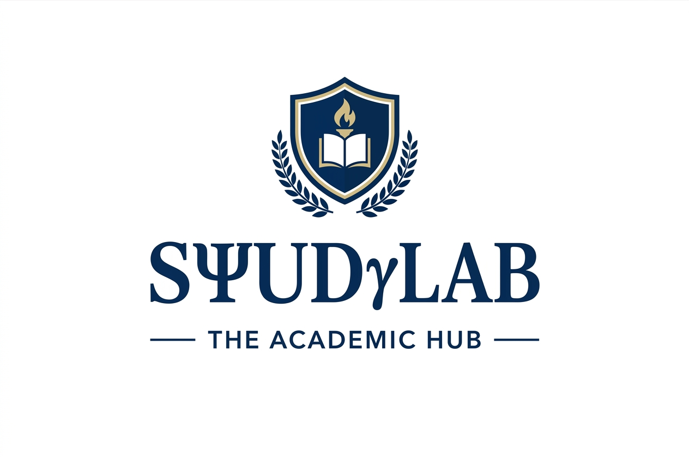
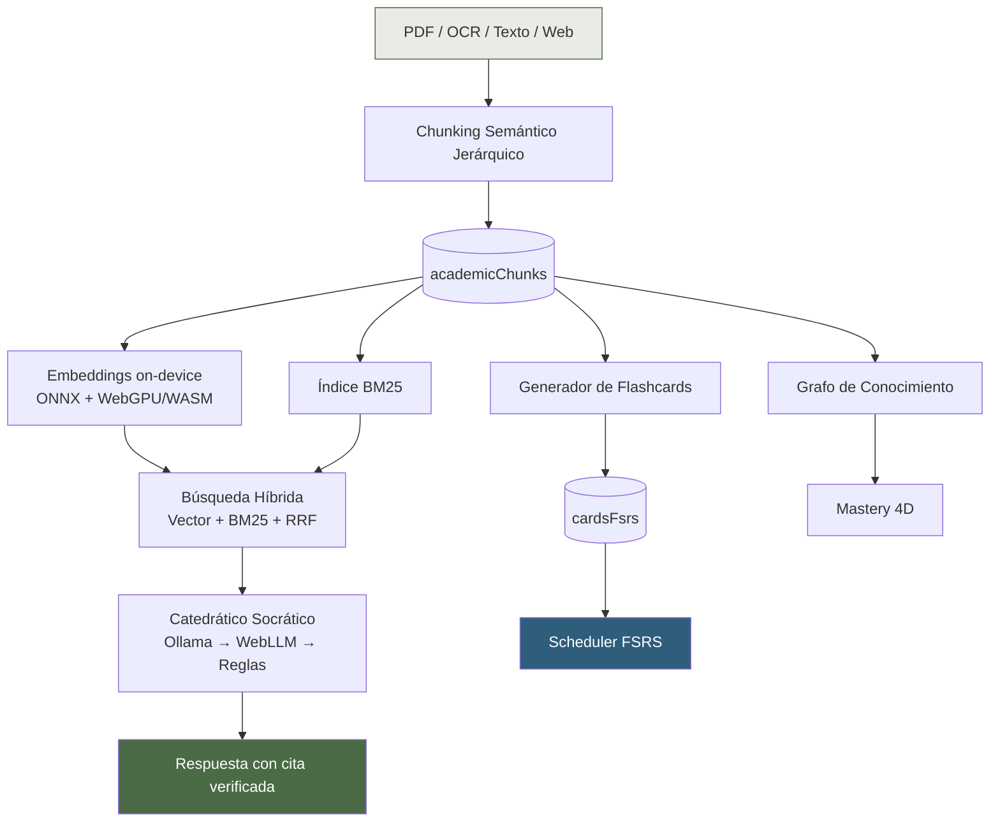

<div align="center">

# 🧠 StudyLab

### Sistema Operativo Cognitivo para Estudiantes Universitarios

**Local-first · Zero-Cloud · Citation-First RAG**

*Todo tu material de cátedra, tu repaso espaciado y tu tutor socrático,<br>corriendo 100% en tu navegador. Sin servidores. Sin suscripción. Sin subir un solo PDF a ningún lado.*

<br>

[](./LICENSE)
[](https://react.dev)
[](https://www.typescriptlang.org)
[](https://vitejs.dev)
[](https://tailwindcss.com)
[](https://dexie.org)
[](#-filosofía)
[](./CONTRIBUTING.md)

<br>

<!--
  Reemplazar por una captura o GIF real del Workspace Académico
  (recomendado: 1280x720, formato GIF o WebP, <5MB)
-->


<br><br>

[Ver demo](#-demo) · [Instalación](#-instalación-rápida) · [Funcionalidades](#-qué-hace-studylab) · [Arquitectura](#-arquitectura) · [Roadmap](#-roadmap) · [Contribuir](#-contribuir)

</div>

<br>

---

## 📖 Por qué existe

El software educativo tradicional falla en tres frentes:

| Problema | Cómo lo resuelve StudyLab |
|---|---|
| **Cloud lock-in y privacidad.** Subís tus apuntes y exámenes a servidores de terceros, pagás una cuota mensual, y tus datos quedan expuestos. | **100% local-first.** Todo vive en tu navegador (IndexedDB + OPFS vía Dexie.js). Funciona offline. Cero costo recurrente. |
| **Pasividad e IA que alucina.** Los chats de IA genéricos te resuelven el ejercicio sin que aprendas nada, e inventan citas que no existen. | **Citation-First.** Ninguna respuesta del Catedrático es válida sin una cita verificada por coordenadas exactas (`boundingBox`) en la página del libro. |
| **Fragmentación cognitiva.** Saltás entre un lector de PDF, Anki, un Pomodoro, Notion y un chat de IA que no se hablan entre sí. | **Un solo bus de datos.** Resaltar un teorema genera una tarjeta FSRS, la vincula al grafo de conocimiento y la deja lista para auditoría socrática, en un clic. |

No es una app de notas con IA encima. Es un intento serio de responder, todos los días, una sola pregunta:

> **¿Qué debería estudiar hoy, y por qué?**

<br>

## ✨ Qué hace StudyLab

<details open>
<summary><strong>🎓 Catedrático Socrático (RAG Citation-First)</strong></summary>
<br>

Un tutor con personalidad de rigor académico que **nunca resuelve el ejercicio por vos**. Audita tu hipótesis, señala omisiones conceptuales y contradicciones, y comprueba todo contra el texto oficial que cargaste — con salto directo a la página y el párrafo exacto.

- Motor de lenguaje de **3 carriles**: Ollama local → WebLLM en navegador (WebGPU) → reglas heurísticas determinísticas. El modo activo siempre está visible — nunca aparenta más inteligencia de la que tiene.
- **3 modos explícitos:** Consulta, Auditoría, Examen — vos elegís cuánto te exige.
- Búsqueda **híbrida real**: vectores densos + BM25 + Reciprocal Rank Fusion, con boost automático para ecuaciones y normas técnicas exactas.
- Visualizador de discrepancias: si tu explicación contradice a la cátedra, se muestra lado a lado con la cita correcta.

</details>

<details>
<summary><strong>🔁 Repetición espaciada real (FSRS v4.5/v5)</strong></summary>
<br>

- Scheduler moderno acoplado a la curva de retención biológica, no un SM-2 de los 90.
- **Oclusión de imágenes** sobre diagramas técnicos (motores, circuitos, diagramas de cuerpo libre) — algo que ni las herramientas de IA en la nube resuelven bien.
- Cloze directo desde cualquier selección de texto en el PDF, con cita adjunta.
- Detección de tarjetas *leech*, balanceo de carga entre días, días fáciles, dispersión de tarjetas hermanas.
- Optimización de pesos FSRS contra tu propio historial de repasos.

</details>

<details>
<summary><strong>🕸️ Grafo de Conocimiento (DAG con mastery 4D)</strong></summary>
<br>

- Conceptos modelados como grafo acíclico dirigido con progresión de prerrequisitos.
- Cada nodo se mide en 4 dimensiones ponderadas: **Retención**, **Comprensión**, **Aplicación**, **Transferencia**.
- Bloqueo *blando*: un prerrequisito débil te avisa y te ofrece un atajo de 4 minutos — nunca te cierra la puerta la noche antes del parcial.

</details>

<details>
<summary><strong>📚 Ingesta, lectura y OCR</strong></summary>
<br>

- Visor de PDF con anotación vectorial (resaltados normalizados, post-its georreferenciados).
- Divisor inteligente de libros: detecta el índice y separa un manual de 500+ páginas en capítulos navegables.
- OCR en el cliente (Tesseract.js) para apuntes escaneados, con capa de texto seleccionable.
- Fórmulas matemáticas jamás transcriptas por error: se marcan como imagen citable en vez de inventarse.

</details>

<details>
<summary><strong>🧭 Planificación y metodologías activas</strong></summary>
<br>

- Planificación **inversa desde la fecha del parcial**, proyectando la retención `R(t)` de cada tema hasta el día del examen.
- Feynman 2.0: detecta jerga no explicada, muletillas evasivas y omisiones críticas en tu propia explicación.
- SQ3R, Active Recall, Interleaving, Pomodoro, sonido ambiental para foco.
- Dashboard diario con "deuda cognitiva de estudio" calculada en minutos reales.

</details>

<details>
<summary><strong>🔒 Privacidad, portabilidad y verificación</strong></summary>
<br>

- Verificador dimensional determinístico en SI (sin IA): detecta `τ = F/r → N/m ≠ N·m` antes de mirar los números.
- Exportación/importación completa del workspace en `.zip`, sin pérdida de estado FSRS.
- Interoperabilidad con Anki (`.apkg`) en ambos sentidos.
- Paquetes de cátedra exportables entre estudiantes — sin servidor, sin cuenta.
- **Consola de Verificación (`/qa`):** cada función del sistema tiene su fila con estado real y un botón de prueba en vivo. Nada se considera "implementado" si no aparece ahí.

</details>

<br>

## 🆚 StudyLab vs. las alternativas

| | StudyLab | NotebookLM | Anki |
|---|:---:|:---:|:---:|
| Corre 100% local / offline | ✅ | ❌ | ✅ |
| Repetición espaciada real (FSRS) | ✅ | ❌ | ✅ |
| Citas verificadas por coordenadas exactas | ✅ | ⚠️ (por fuente, en la nube) | ❌ |
| Tutor que audita en vez de resolver | ✅ | ❌ | ❌ |
| Grafo de prerrequisitos con mastery 4D | ✅ | ❌ | ❌ |
| Planificación inversa desde fecha de examen | ✅ | ❌ | ❌ |
| Oclusión de imágenes técnicas | ✅ | ❌ | ⚠️ (plugin) |
| Generación de resúmenes multi-formato | ⚠️ (resumen narrado) | ✅ (audio/video cinemático) | ❌ |

> NotebookLM te ayuda a entender el material hoy. StudyLab te asegura que todavía lo sepas el día del parcial.

<br>

## 🏗️ Arquitectura



Todo el pipeline —desde el PDF hasta la cita verificada— corre en el navegador del usuario. Ningún dato sale del dispositivo salvo que el propio usuario lo exporte.

<br>

### Stack tecnológico

| Capa | Tecnología |
|---|---|
| Núcleo / UI | React 19 + TypeScript 5/6 |
| Bundler | Vite 8 (motor Rolldown) |
| Estilos | Tailwind CSS v4 + Design Tokens |
| Persistencia | Dexie.js 4 (IndexedDB) + OPFS para binarios |
| Matemática | KaTeX 0.18 |
| Documentos | PDF.js 6.2 + pdf-lib 1.17 |
| OCR | Tesseract.js 7.0 |
| Embeddings | Transformers.js (ONNX Runtime Web) |
| Repetición espaciada | FSRS v4.5 / v5 |
| LLM en navegador | WebLLM (WebGPU) |
| Audio | Web Speech API nativa |
| Linter | oxlint |

<br>

## 🚀 Instalación rápida

```bash
# Cloná el repositorio
git clone https://github.com/tu-usuario/studylab.git
cd studylab

# Instalá las dependencias
npm install

# Levantá el servidor de desarrollo
npm run dev
```

Abrí `http://localhost:5173` — no necesitás base de datos, backend, ni variables de entorno. Todo corre en tu navegador desde el primer segundo.

<details>
<summary>Comandos adicionales</summary>
<br>

```bash
npm run lint       # Análisis estático — debe arrojar 0 advertencias
npm run build       # Compilación de producción + chequeo estricto de tipos
npm run preview     # Previsualizar el bundle de producción
npm test            # Suite de tests de lógica pura
```

</details>

<details>
<summary>Requisitos del navegador</summary>
<br>

| Función | Requisito | Degradación si falta |
|---|---|---|
| Embeddings acelerados | WebGPU | Cae a WebAssembly (más lento, funciona igual) |
| Carril WebLLM | WebGPU | Cae al carril de reglas heurísticas |
| Almacenamiento de binarios | OPFS | Cae a Blobs en IndexedDB |
| Persistencia contra desalojo | `navigator.storage.persist()` | Se recomienda backup manual periódico |

Recomendado: Chrome/Edge actualizado para la experiencia completa con WebGPU. Firefox y Safari funcionan con degradación automática.

</details>

<br>

## 📁 Estructura del proyecto

```
StudyLab/
├── src/
│   ├── db/                     # Esquema Dexie (IndexedDB)
│   ├── features/
│   │   ├── academic-engine/    # RAG Socrático, chunking, embeddings, FSRS gen
│   │   ├── fsrs/                # Scheduler y modelo de repetición espaciada
│   │   ├── document-viewer/    # Visor y anotador de PDF
│   │   ├── ocr/                 # Reconocimiento óptico de caracteres
│   │   ├── books/               # Divisor inteligente de libros
│   │   └── files/               # Explorador de archivos universitario
│   ├── pages/                   # Rutas principales de la aplicación
│   ├── components/              # UI, layout, LaTeX, voz, progreso
│   ├── hooks/  ·  stores/  ·  lib/
├── docs/                        # Documentación técnica y assets
└── public/                      # Workers y assets estáticos
```

<br>

## 🗺️ Roadmap

- [x] **Fase 0–0.5** — Fundaciones: embeddings on-device, búsqueda híbrida, 3 carriles de IA, almacenamiento con cuota y respaldo
- [x] **Fase 1–7** — Motor de estudio 4D, Dashboard diario, recall activo, planificación, grafo de conocimiento, oclusión de imágenes, Feynman 2.0
- [x] **Fase 9–10** — Sostenibilidad del repaso, planificación de examen, verificador dimensional, interoperabilidad Anki, PWA offline
- [ ] **Fase 11** — Consola de Verificación (`/qa`), Audio Overview local, ingesta ampliada (texto/web/transcripción), síntesis multi-fuente

Ver el detalle completo de cada fase en [`docs/prompt-maestro.md`](./docs/prompt-maestro.md).

<br>

## 🤝 Contribuir

StudyLab nació para resolver un problema propio de cursada — se agradecen ideas, reportes de bugs y PRs. Antes de abrir uno, revisá [`CONTRIBUTING.md`](./CONTRIBUTING.md).

Reglas no negociables del proyecto (ver [`docs/prompt-maestro.md`](./docs/prompt-maestro.md) sección 38):

1. No destruir datos del estudiante.
2. No inventar citas ni precisión falsa.
3. No romper funcionalidad existente.
4. Privacidad local-first, siempre.

<br>

## 📜 Licencia

Distribuido bajo licencia MIT. Ver [`LICENSE`](./LICENSE) para más detalles.

<br>

## 🙌 Reconocimientos

Construido sobre trabajo abierto de: [FSRS](https://github.com/open-spaced-repetition), [PDF.js](https://github.com/mozilla/pdf.js), [Transformers.js](https://github.com/xenova/transformers.js), [WebLLM](https://github.com/mlc-ai/web-llm), [Tesseract.js](https://github.com/naptha/tesseract.js), [Dexie.js](https://github.com/dexie/Dexie.js).

<br>

---

<div align="center">

Hecho con 🧉 y demasiado café, entre cursadas de Ingeniería Electromecánica.<br>
**UTN Facultad Regional Mendoza** · Luján de Cuyo, Argentina

<sub>¿Te sirvió? Dejá una ⭐ — ayuda más de lo que parece.</sub>

</div>
