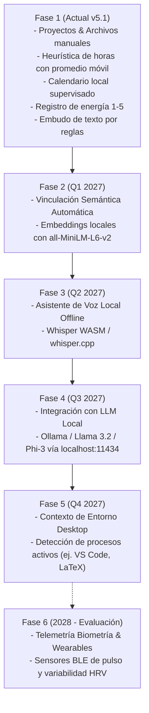

# Roadmap de Evolución Arquitectónica: Context Engine (Motor de Contexto)

**Fecha de documento:** Septiembre 2026  
**Módulo:** `src/features/context-engine/`  
**Estado en v5.1:** Fase 1 (Acotada y Local-First) Implementada • Fases 2 a 6 en Planificación Formal

---

## 1. Visión y Límites de Diseño

El **Context Engine** de StudyLab / CognitiveOS fue concebido originalmente bajo la aspiración de un *"sistema operativo de vida unificado"* capaz de orquestar Acción, Cronos, Segundo Cerebro y Biometría.

Sin embargo, para salvaguardar la estabilidad del producto, la privacidad innegociable de los datos académicos y el consumo moderado de recursos en computadoras portátiles convencionales (CPU de 2 a 4 núcleos y discos SATA), la **versión 5.1 implementa estrictamente el núcleo funcional verificable**:
- Vinculación manual de proyectos con carpetas y documentos de la biblioteca.
- Estimador heurístico de horas de estudio con ajuste por promedio móvil.
- Bloqueo semanal de horarios en calendario local con confirmación explícita obligatoria.
- Registro subjetivo de energía post-sesión (1 a 5) y detección estadística del bloque biológico óptimo tras 10 muestras.
- Embudo unificado de texto con análisis determinista por reglas y vista previa editable previa a persistencia.

Todas las demás capacidades de automatización ambiental o sensores externos quedan formalmente excluidas del código ejecutable actual y se documentan en este pliego como **fases de roadmap futuro**.

---

## 2. Fases Futuras del Roadmap (No Implementadas en v5.1)

---

### Fase 2: Vinculación Semántica Automática Proyecto &rarr; Biblioteca
- **Propósito:** Reutilizar el pipeline de embeddings denso existente (`@xenova/transformers` con `Xenova/all-MiniLM-L6-v2`) para que, al ingresar el nombre o descripción de un proyecto (ej. *"Bioquímica Enzimática"*), el sistema calcule la similitud coseno contra los fragmentos de la biblioteca y sugiera automáticamente documentos relevantes.
- **Criterio de Aceptación:** Las sugerencias se mostrarán como tarjetas de aprobación manual; el usuario deberá marcar un checkbox para cada documento sugerido antes de que quede asociado formalmente al proyecto.

---

### Fase 3: Asistente de Entrada por Voz 100% Offline
- **Propósito:** Reemplazar o complementar el embudo de texto libre con captura de voz para dictar notas, tareas y eventos.
- **Restricción Arquitectónica Innegociable:**
  - Prohibido el uso de APIs externas de reconocimiento de voz (Google Cloud Speech, Whisper API en la nube, etc.).
  - Implementación obligatoria mediante `whisper.cpp` embebido en Rust o modelo ONNX cuantizado en WebAssembly (`whisper-tiny` o `whisper-base`) corriendo íntegramente en local.

---

### Fase 4: Agente Cognitivo de Contexto con LLM Local (Ollama)
- **Propósito:** En lugar de reglas regex estáticas, permitir que un modelo de lenguaje local analice el texto del embudo, extraiga fechas relativas complejas (*"el segundo martes de noviembre después del práctico"*) y proponga desgloses temáticos de estudio.
- **Arquitectura:**
  - Conexión exclusiva a servidores locales (`http://localhost:11434` vía Ollama o `llama.cpp`).
  - Modelos recomendados: `llama3.2:1b` / `llama3.2:3b` o `phi3:mini`.
  - El usuario debe habilitar explícitamente el switch de Ollama en los Ajustes del sistema y tener el demonio activo en su máquina.

---

### Fase 5: Activación por Contexto Físico y de Entorno Desktop
- **Propósito:** Detectar qué herramientas de trabajo tiene abiertas el estudiante para sugerir el perfil cognitivo adecuado (ej. si está abierto Visual Studio Code o RStudio, sugerir perfil *Deep Problem Solving*; si está abierto un visor de diapositivas, sugerir *Memory Fortress*).
- **Alcance evaluado:** Consulta de ventanas nativas mediante Tauri en Rust con bajo consumo de CPU.
- **Límites éticos:** Cero keylogging, cero rastreo de navegación web personal y cero telemetría externa. La inspección se limitará a títulos de proceso relevantes configurados en una lista blanca por el propio estudiante.

---

### Fase 6: Monitoreo Biométrico & Wearables (Bajo Evaluación de Viabilidad)
- **Propósito:** Captura de variabilidad de la frecuencia cardíaca (HRV) o intervalos de parpadeo para alimentar el monitor de fatiga cognitiva con datos fisiológicos objetivos.
- **Desafíos Técnicos Identificados:**
  - La mayoría de los protocolos de wearables comerciales (Apple Watch, Garmin, Fitbit) imponen ecosistemas propietarios en la nube que violan la premisa local-first de StudyLab.
  - Se requeriría conectividad directa por Bluetooth Low Energy (BLE) mediante protocolos abiertos (como el perfil estándar GATT Heart Rate Service `0x180D`).
- **Disposición:** Se mantiene congelado en etapa de investigación hasta que existan APIs abiertas multiplataforma estables en Rust/WebBluetooth sin dependencias de servicios en la nube.

---

## 3. Resumen de Compromisos Éticos y Técnicos

1. **Local-First Permanente:** Ninguna fase futura del Context Engine transmitirá datos a la nube por defecto.
2. **Supervisión Humana Requerida:** Todo reagendamiento, estimación o creación de eventos requerirá confirmación de 1 clic en la interfaz. No se permitirán modificaciones autónomas de calendarios o tareas.
3. **Opt-In Explícito:** Cualquier sensor o modelo complementario permanecerá desactivado de forma predeterminada hasta que el usuario decida activarlo voluntariamente en `/settings`.
